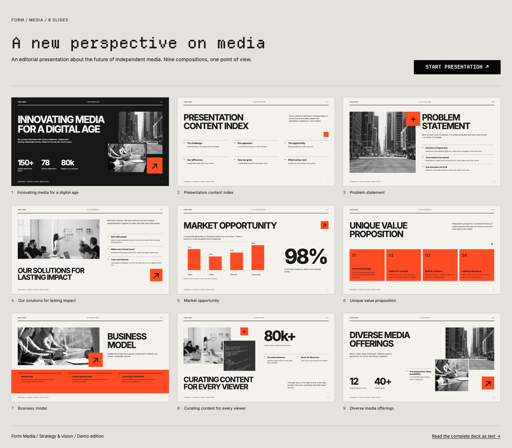

# Presentations

[](https://github.com/kujolang/presentations)
[](LICENSE)
[](https://github.com/kujolang/kujo)

Build browser presentations with Kujo SSG and SiteKit. Choose a starter, add your
content, and generate static slides, an overview, a readable text edition, and printable pages.
Optional presenter tools keep speaker notes local to the presenter tab.

Presentations is an optional package. It adds no code or dependencies to SSG or
SiteKit. Version 0.1.0 is a preview; the content and extension APIs may change.
See [release status](docs/release.md) before distributing it, and the
[readiness review and next steps](docs/readiness-review.md) for known limits.



## Quick start

Install Git, Node 20+, and [Kujo 1.5+](https://github.com/kujolang/kujo), then run:

```sh
git clone https://github.com/kujolang/presentations.git
cd presentations
npm run deck -- start investor my-pitch --title "My company"
```

This copies a starter to `decks/my-pitch/`, installs pinned SSG and SiteKit
versions, builds the deck, and serves it at `http://127.0.0.1:8086/`.
Press Ctrl+C to stop. Use `--port 8087` if the port is busy.
The draft contains placeholders for your facts and images.

| Starter | Purpose |
| --- | --- |
| `investor` | Explain the problem, product, market, traction, team, and funding ask |
| `live-talk` | Teach an idea through a hook, example, practical steps, and discussion |
| `sales` | Connect a buyer's needs to your offer, delivery plan, price, and next step |

For an agent-led workflow, give your agent [CREATE_A_DECK.md](CREATE_A_DECK.md)
and your brief. The catalog, JSON Schema, and layout limits describe what it can
build. See [getting started](docs/getting-started.md) for setup and troubleshooting.

## Edit and review

Edit `decks/my-pitch/deck.json` for content and order, `assets/theme.css` inside
that deck for its appearance, and `BRIEF.md` for sources and decisions.
Then run:

```sh
npm run deck -- check --deck decks/my-pitch --ready
npm run deck -- build --deck decks/my-pitch
npm run deck -- preview --deck decks/my-pitch
```

`check --ready` rejects unfinished placeholders. It does not verify facts or
visual fit. Review every slide before presenting. Changes require a rebuild;
the preview does not watch files.

Ten reusable layouts cover titles, indexes, images, metrics, features, business
models, and percentage charts. The canvas keeps its 16:9 composition as the
browser resizes. The overview, controls, and text edition adapt to the viewport.
See [authoring](docs/authoring.md) for fields, themes, and custom layouts.

## Motion and controls

Optional Motion presets range from fade, slide, and zoom to coordinated
headline, image, card, and chart animations. Editorial, Focus, and Kinetic
presets support per-slide settings, intensity, timing, and stagger.
Use **Replay entrance** to review an effect.

Motion loads from local files only when needed. Viewers can turn it off, and
system reduced-motion preferences always take precedence.
See [transitions](docs/transitions.md) for configuration.

| Control | Action |
| --- | --- |
| Left / Right | Previous / next slide |
| Space | Next slide; keeps normal behavior on buttons and links |
| Home / End | First / last slide |
| F / Escape | Enter slide-only fullscreen / exit fullscreen |
| Overview | View linked thumbnails of all slides |
| Read text | Read the deck, chart values, and image descriptions as a normal page |

Shortcuts leave text inputs and browser modifier keys alone. Native links work
without JavaScript. Fullscreen and enabled transitions fetch generated pages;
failed fetches fall back to normal navigation.

## Build and host

With dependencies installed under `.deps/`, or sibling `ssg/` and built
`site-kit/` checkouts, run from this repository:

```sh
kujo run build.kujo
kujo run build.kujo -- --deck examples/field-notes
kujo serve output --port 8086
```

Open `http://127.0.0.1:8086/reference/` or `/field-notes/`.
For dependencies elsewhere:

```sh
kujo run build.kujo -- --deck /path/to/my-deck \
  --ssg /path/to/ssg --sitekit /path/to/site-kit/dist \
  --site-url https://example.com/my-deck
```

`npm run deck -- setup` installs the pinned versions in [dependencies.json](dependencies.json)
under `.deps/`. Pass `--ssg .deps/ssg --sitekit .deps/site-kit/dist` to use those
paths explicitly with the native builder. Both entry points prefer `.deps/`
when available and otherwise use siblings. The Node CLI handles setup and review; Kujo renders
the deck.

Deploy `output/<deck-id>/` to a static host with directory-index support. Each
slide has a numbered URL, such as `/1/`, plus `/reading/` for the text edition.
Direct links and refresh need no rewrite rules. Relative links support hosting
under a subdirectory. Use HTTP for local previews; `file://` is not supported.

The build replaces `.build/<deck-id>/` and `output/<deck-id>/`. Keep authored
files elsewhere, and never run two builds for the same deck ID at once.

## Architecture

```text
Kujo SSG ─── CLI and templates ──┐
                               ├── Presentations ── individual decks
SiteKit ─── CSS and tokens ─────┘
```

The presentation package owns layouts, content validation, canvas geometry,
controls, and motion. SSG generates pages and copies assets. SiteKit supplies
controls, layout utilities, focus styles, and default tokens. Decks own content,
images, and themes. Neither upstream project depends on Presentations.
See [architecture](docs/architecture.md) for the boundaries and build process.

## Repository layout

| Path | Purpose |
| --- | --- |
| `build.kujo` | Stable public command; delegates to `src/build.kujo` |
| `src/` | Native build, validation, and rendering implementation |
| `assets/`, `layouts/` | Browser behavior, CSS, and reusable compositions |
| `scripts/` | Setup, authoring, bundling, and inspection tools |
| `examples/`, `starters/` | Separate content, themes, and starting points |
| `tests/`, `docs/` | Verification and author/maintainer guides |
| Root manifests and schema | Package metadata, pinned dependencies, and editor discovery |

The root entry point, manifests, schema, license, and agent instructions remain
where the CLI and package tools expect them. Generated output stays ignored.
Use trusted asset trees: every file under a deck's `assets/` is published in its
output. Validation rejects hidden entries, symlinks, and special files. Failed
builds preserve the last successful deck; same-ID builds are locked. See [deployment guidance](docs/deployment.md) for hosting and access.

## Verify

```sh
npm ci
npx playwright install chromium firefox webkit
npm test
```

Tests cover content validation, routes, assets, keyboard controls, history,
fullscreen, canvas layout, no-JavaScript navigation, motion, and axe accessibility
checks. Browser screenshots go to `test-results/`. Automated checks do not replace
visual, factual, or accessibility review.

The media example uses fictional copy and metrics and follows a written design
brief. It is not a verified pixel match to a source image. Photography comes from
local NASA photographs with recorded source credits; see [asset sources](examples/reference/ASSETS.md).

## Documentation

- [Getting started](docs/getting-started.md)
- [Agent workflow](CREATE_A_DECK.md)
- [Content, themes, and layouts](docs/authoring.md)
- [Motion settings](docs/transitions.md)
- [Language, presenter tools, and PDF](docs/presentation-features.md)
- [Performance measurements and budgets](docs/performance.md)
- [Support matrix and host checks](docs/support-matrix.md)
- [Release status and checks](docs/release.md)
- [Readiness review](docs/readiness-review.md)
- [Build-safety follow-up and next priorities](docs/next-session-build-safety.md)
- [Static hosting and access](docs/deployment.md)
- [Changelog](CHANGELOG.md)

Project code is released under the [MIT license](LICENSE). Bundled fonts, Motion,
and NASA photographs retain their own terms; see the asset credits and license files.
